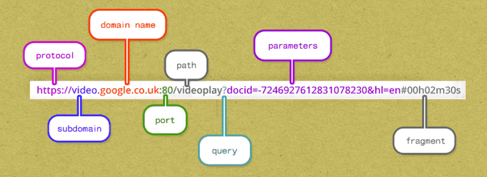

# Passing values

## Form submission

We can pass values from the client to the server through the URL or through the body of the request. 

When you submit a form, you can use either the "POST" or "GET" method. The "POST" method sends the form submission through the body of the request. The "GET" method for a form submission sends the form submission values through the url.

I remember this like this:

```
post
body

get
url
```

**Post** has four letters and so does **form**.

**Get** has three letters and so does **url**.

***

## URL values

You can always append values to a URL.

Anything after the ```?``` is the query string - the area where values are stored.



The values are stord in a ```identifier=value``` fashion.

You can have multiple ```identifier=value``` by separating them with the ```&``` ampersand.

***

## Retrieving values

While there are multiple ways to retrieve values, we will stick with:

[func (*Request) FormValue](https://godoc.org/net/http#Request.FormValue)
``` Go
func (r *Request) FormValue(key string) string
```
FormValue returns the first value for the named component of the query. POST and PUT body parameters take precedence over URL query string values. FormValue calls ParseMultipartForm and ParseForm if necessary and ignores any errors returned by these functions. If key is not present, FormValue returns the empty string. To access multiple values of the same key, call ParseForm and then inspect Request.Form directly.


# Cookies

A cookie is a file that is stored on the client's machine.

Cookies are written by domains to store information on the client's machine.

## Domain specific

Cookies are only sent by the browser to the domain which wrote them.

With every request to a specific domain, the client's web browser looks to see if there is a cookie from that domain on the client's machine. If there is a cookie that has been written by that particular domain, then the browser will send the cookie with every request to that domain.

Cookies are domain specific.

## Limits

We can store whatever information we would like in a cookie up to a certain size limit. The size limit of a cookie is dependent upon the browser but is usually around 4096 characters.

There is also a limit to the number of cookies one domain can write. This limit is also browser specific.

See [this resource](http://browsercookielimits.squawky.net/) for more information.

## Expiring a cookie

If the **Expires** or **MaxAge** field isn't set, then the cookie is deleted when the browser is closed. This is colloquially known as a "session cookie."

You can expire a cookie by setting one of these two fields: **Expires** or **MaxAge**

**Expires** sets the exact time when the cookie expires. Expires is **Deprecated**.

**MaxAge** sets how long the cookie should live (in seconds).


